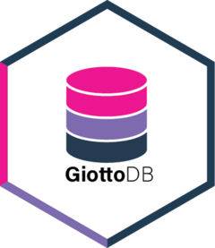

# GiottoDB  
<!-- badges: start -->
[](https://opensource.org/licenses/MIT)
[](https://www.gnu.org/licenses/gpl-3.0)
[](https://lifecycle.r-lib.org/articles/stages.html#experimental)

<!-- badges: end -->

The goal of `GiottoDB` is to provide [dbverse](https://github.com/dbverse-org) interoperability with objects from [Giotto Suite](https://giottosuite.com/) for spatial omics data analysis in R.

## Installation

``` r
# install.packages("pak")
pak::pak("giotto-suite/GiottoDB")
```

## Example

```r
library(GiottoDB)
library(GiottoData)
library(DBI)
library(duckdb)

# Load a small example Giotto object.
gobject <- GiottoData::loadGiottoMini("visium")

# Create GiottoDB object with a temporary local database.
db_path <- tempfile("giottodb-mini-", fileext = ".duckdb")
con <- DBI::dbConnect(duckdb::duckdb(), dbdir = db_path)
gdb <- as_giottodb(gobject, con = con)

# Preview the GiottoDB object
gdb
DBI::dbListTables(con)

# Disconnect from the database and clean up
DBI::dbDisconnect(con, shutdown = TRUE)
```
