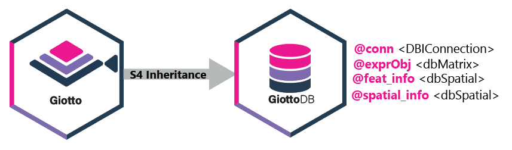

```{r, include = FALSE}
knitr::opts_chunk$set(
  collapse = TRUE,
  comment = "#>"
)
```
## Overview
`GiottoDB` is a module in the [Giotto Suite ecosystem](https://drieslab.github.io/Giotto_website/articles/ecosystem.html) that provides database support for core `Giotto` functionality through [dbverse](https://github.com/dbverse-org).

{width=100%}

## GiottoDB function support
The table below summarizes GiottoDB-native methods and Giotto functions that are supported for GiottoDB objects.

| Category | Function | Description |
|---|---|---|
| Object creation | [`GiottoDB()`](../reference/GiottoDB.html) | Create a database-backed GiottoDB object. |
| Object creation | [`as_giottodb()`](../reference/as_giottodb.html) | Convert a Giotto object to a GiottoDB object. |
| Object creation | [`as_giotto()`](../reference/as_giotto.html) | Convert a GiottoDB object back to an in-memory Giotto object. |
| Saving and loading | [`saveGiotto()`](../reference/saveGiotto.html) | Save a GiottoDB object with its database-backed data. |
| Saving and loading | [`loadGiotto()`](../reference/loadGiotto.html) | Load a saved GiottoDB object. |
| Saving and loading | [`loadGiottoDB()`](../reference/loadGiottoDB.html) | Load a GiottoDB object from a saved GiottoDB project. |
| Connection management | [`dbReconnect()`](../reference/dbReconnect-GiottoDB-method.html) | Reconnect stale database-backed slots after loading. |
| Configuration | [`GiottoDB-options`](../reference/GiottoDB-options.html) | Review global options used by GiottoDB-backed workflows. |
| Expression objects | [`createExprObj()`](https://drieslab.github.io/GiottoClass/reference/createExprObj.html) | Create Giotto expression objects that can contain database-backed matrices. |
| Expression access | [`getExpression()`](https://drieslab.github.io/GiottoClass/reference/getExpression.html) | Retrieve expression objects or matrices from GiottoDB objects. |
| Expression processing | [`filterGiotto()`](https://drieslab.github.io/Giotto_website/reference/filterGiotto.html) | Filter cells and features while preserving database-backed expression data. |
| Expression processing | [`processExpression()`](https://drieslab.github.io/Giotto_website/reference/processExpression.html) | Run supported expression-processing workflows on dbMatrix-backed expression data. |
| Expression processing | [`processData()`](../reference/processData-dbMatrix-methods.html) | Run dbMatrix-backed expression processing methods used by Giotto workflows. |
| Expression processing | [`normalizeGiotto()`](../reference/normalizeGiotto.html) | Normalize database-backed expression matrices. |
| Expression processing | [`addStatistics()`](../reference/addStatistics.html) | Add cell and feature statistics from database-backed matrices. |
| Expression processing | [`calculateHVF()`](../reference/calculateHVF.html) | Identify highly variable features from database-backed matrices. |
| Dimension reduction | [`runPCA()`](../reference/runPCA.html) | Run PCA using database-backed matrix operations. |
| Dimension reduction | `runUMAP()` | Run UMAP from supported reduced dimensions. |
| Clustering | [`doLeidenCluster()`](https://giottosuite.com/reference/doLeidenCluster.html) | Cluster cells from supported nearest-neighbor graphs or reduced dimensions. |
| Clustering | [`doLeidenClusterIgraph()`](https://giottosuite.com/reference/doLeidenClusterIgraph.html) | Run Leiden clustering through Giotto's igraph workflow. |
| Differential expression | [`findMarkers_one_vs_all()`](../reference/findMarkers_one_vs_all.html) | Run one-versus-all marker testing on supported GiottoDB objects. |
| Subcellular workflow | [`createGiottoPoints()`](../reference/createGiottoPoints.html) | Create Giotto point objects backed by dbSpatial where applicable. |
| Subcellular workflow | [`createGiottoPolygon()`](../reference/createGiottoPolygon.html) | Create Giotto polygon objects backed by dbSpatial where applicable. |
| Subcellular workflow | [`calculateOverlap()`](../reference/calculateOverlap.html) | Compute overlaps between spatial features. |
| Subcellular workflow | [`overlapToMatrix()`](../reference/overlapToMatrix.html) | Convert spatial overlaps to matrix-like outputs. |
| Subcellular workflow | [`tessellate()`](../reference/tessellate.html) | Generate square or hexagonal tessellations. |
| Visualization | `spatPlot2D()` | Create standard Giotto spatial plots for supported GiottoDB objects. |
| Visualization | [`spatInSituPlotPoints()`](../reference/spatInSituPlotPoints.html) | Visualize in situ point features from GiottoDB objects. |
| Visualization | `plotPCA()` | Plot PCA embeddings from GiottoDB objects. |
| Visualization | `plotUMAP()` | Plot UMAP embeddings from GiottoDB objects. |

## Performance
Benchmark summaries are available in the [benchmarks vignette](Benchmarks.html).
